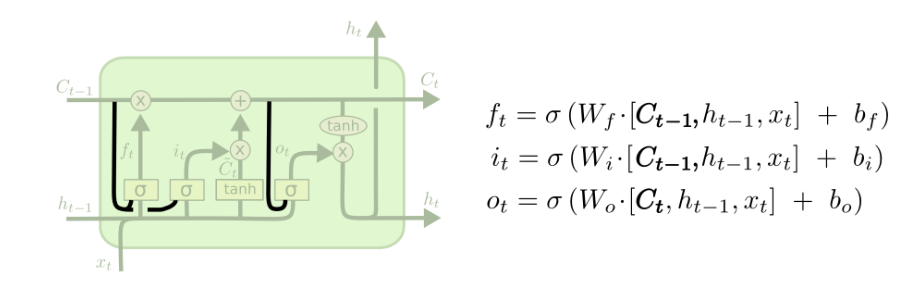

# DL4NLP: Summary

- [DL4NLP: Summary](#dl4nlp-summary)
  - [Chapter 1: Intro](#chapter-1-intro)
  - [Chapter 2: Machine Learning Pipeline](#chapter-2-machine-learning-pipeline)
  - [Chapter 3: Learning Basics and Linear Models](#chapter-3-learning-basics-and-linear-models)
    - [Train, Validation and Test Set](#train-validation-and-test-set)
    - [Linear Models](#linear-models)
    - [Linear Separability](#linear-separability)
    - [Loss Functions](#loss-functions)
    - [Regularization](#regularization)
    - [Gradient-based Optimization](#gradient-based-optimization)
  - [Chapter 4: Neural Networks](#chapter-4-neural-networks)
    - [Activation Functions](#activation-functions)
    - [Different Types of NN-Models](#different-types-of-nn-models)
    - [Training NNs](#training-nns)
      - [Computation Graph Abstraction (DAG)](#computation-graph-abstraction-dag)
      - [Backpropagation](#backpropagation)
    - [Tips & Tricks When Training NN](#tips--tricks-when-training-nn)
  - [Representations (Chapters 6,8,9)](#representations-chapters-689)
    - [Types of Features](#types-of-features)
    - [Sparse Vector Representations](#sparse-vector-representations)
    - [Encoding Categorical Features](#encoding-categorical-features)
    - [Combining Dense Vectors](#combining-dense-vectors)
  - [Embeddings (Chapters 10,11)](#embeddings-chapters-1011)
    - [Tips & Tricks regarding Embeddings](#tips--tricks-regarding-embeddings)
    - [Pre-Trained Word Embeddings](#pre-trained-word-embeddings)
      - [Distributional Hypothesis](#distributional-hypothesis)
      - [Distributed Representations](#distributed-representations)
      - [word2vec, an example of a distributed representation algorithm](#word2vec-an-example-of-a-distributed-representation-algorithm)
      - [Strategies and Techniques](#strategies-and-techniques)
      - [Other well-known algorithms](#other-well-known-algorithms)
    - [Char-based and Sub-Word Embeddings](#char-based-and-sub-word-embeddings)
  - [Convolutional Neural Networks (CNNs/ConvNets) (Chapter 13)](#convolutional-neural-networks-cnnsconvnets-chapter-13)
    - [CNN Architecture](#cnn-architecture)
      - [Convolution Step](#convolution-step)
      - [Pooling Step](#pooling-step)
    - [1D Convolution over Text](#1d-convolution-over-text)
    - [Pooling](#pooling)
    - [Alternative: Feature-Hashing](#alternative-feature-hashing)
    - [Hierarchical Convolutions](#hierarchical-convolutions)
    - [Issues with Deep CNNs](#issues-with-deep-cnns)
  - [Recurrent Neural Networks (RNNs) (Chapters 14,15,16)](#recurrent-neural-networks-rnns-chapters-141516)
    - [The RNN Abstraction](#the-rnn-abstraction)
    - [RNN Training](#rnn-training)
      - [Dropout in RNN](#dropout-in-rnn)
    - [Bi-Directional RNN](#bi-directional-rnn)
    - [Multi-Layer (Stacked) RNNs / _deep RNNs_](#multi-layer-stacked-rnns--_deep-rnns_)
    - [RNN Applications / Usages](#rnn-applications--usages)
    - [Exploding and Vanishing Gradients with Simple RNNs](#exploding-and-vanishing-gradients-with-simple-rnns)
      - [RNN Architectures](#rnn-architectures)
      - [Simple RNN (S-RNN)](#simple-rnn-s-rnn)
    - [Gated Architectures](#gated-architectures)
      - [LSTM (Long Short-Term Memory)](#lstm-long-short-term-memory)
      - [GRU (Gated Recurrent Unit)](#gru-gated-recurrent-unit)
      - [Other RNN Usage](#other-rnn-usage)
    - [RNN Generators](#rnn-generators)
    - [Conditioned Generation](#conditioned-generation)
    - [Sequence to Sequence Models: Encoder-Decoder Framework](#sequence-to-sequence-models-encoder-decoder-framework)
    - [Next Step? (Soft-) Attention](#next-step-soft--attention)
      - [Attention](#attention)

<div style="page-break-after: always;"></div>

## Chapter 1: Intro

Humas are good at understanding the nuances of language but poor at formally describing the rules that govern it.

**So far**, supervised machine learning algorithms came up with usage patterns and regularities for word usage
=> finding the decisive words to classify an example into a specific category.

ML methods excel when a **good set of rules is very hard to define/obtain** (discovering the function) but **classifying an example into a category is easy** (assiging the label).

characteristics and problems of natural language:

- **discrete and symbolic**: characters => words => objects, concepts, sentences, actions

  - words cannot compared like colors. e.g., sandwhich and pizza don't have an inherent relation that can be inferred from the symbols/chars apart from that both contain the chars 'a' and 'i'.

- **compositional: characters** => words => objects, concepts, sentences, actions. the meaning of a sentence can be larger than the meaning of a word.

- **data sparsity**: the number of correct word combinations and valid sentences is almost unlimited

## Chapter 2: Machine Learning Pipeline

1. Feature Selection: Extraction, Encoding, Transformation (e.g., normalization, standardization)

   > Standardization and Normalization are important in NN-models as these are sensitive to different scales.

2. Performance Metric Selection: Internval (directly optimized during trainig) vs. External (application specific)

3. Selection of Classifier/Regression Model, Optimization Algo, Loss Function, Regularization, Parameter Turning

4. Evaluation of Models: Cross Validation

**"No Free Lunch Theorem":** Any two algorithms are equivalent whent heir performance is averaged across all possible problems => careful selection of algorithm for dataset/problem is necessary.

<div style="page-break-after: always;"></div>

## Chapter 3: Learning Basics and Linear Models

**hypothesis class**: family of functions (e.g., linear functions, decision trees, etc.) => creates an **inductive bias** (bias-variance tradeoff) - limits the best possible result to the best possible result given the chosen functions

**main goal**: learned functions need to generalize well to previously unseen examples

#### Train, Validation and Test Set

**leave-one-out** cross validation: good approximation of accuracy, costly - computation time!

> **random splitting / leave-one-out** is problematic with natural language since it's sequence data. old language data should be used to predict new data points. new data points should not be used during training.

**held-out set / k-fold** cross validation: split data into 5-10 folds, use 1 fold as validation set (~10-20% of data is used for validation) and train on k-1 folds, each time the same model is trained => a different folds is used for validation.

**balancing, shuffling, stratifying**: shuffle the data before splitting, classes of examples should be balanced and if possible the splits should be stratified => contain the same number of examples of each class per split

**three-way split**: need a third split if multiple models shall be trained, tweak and compared according to their quality. If only two splits (train/validation) are used => result on validation set is overly optimistic.

> All experiments, tweaks, error analysis and model selection are performed on the **validation set**.
> 
> The final/selected model is run once against the **test set** => good estimate of the expected quality of the model on unseen data i.e. its ability to generalize.

#### Linear Models

$ f(x) = xW + b $ or $ f(x;W,b) = xW + b $

+: easy, efficient to train, strictly convex optimization => always converges to the global minima

-: restricted to linear relations


**binary classification:** $ f(x) = sign(xW + b)$

If $x=[x_1, x_2]$ then $sign(x_1W_1 + x_2W_2 + b) = sign(prize * W_1 + size * W_2 + b)$ => can be interpreted as weighting the factors relative to each other.

**log-linear classification / "sigmoid" function**: $\sigma(x) = \frac{1}{1 + \exp(-x)}$

send result of $f(x)$ through sigmoid function $\sigma(f(x))$ => produces confidence levels between \[0,1]

> can be seen as a MLP with a single neuron and sigmoid activation function.

**multi-class classification**: 2+ classes

find the argmax of the vector of scores $\hat{y} = \mathop{argmax}_i \mathbf{\hat{y}}$

**log-linear multi-class classification - softmax function**

$$
\mathbf{\hat{y}}_i = softmax(xW + b) = \frac{\exp(xW + b)_i}{\sum_j \exp(xW + b)_j}
$$

Forces all values of $\mathbf{\hat{y}}$ to be positive and sum to 1 => produces an interpretable probability distribution.

#### Linear Separability

A dataset is **linearly separable** if a straight line can separate the classes. => solutions if not separable:

1. move to **higher dim** (add more features => e.g., polynomial regression / classification)

2. use **richer hypothesis class** (e.g., non-linear models such as NN or kernelized-methods which operate in higher dimensions).

   A **kernel method** defines a generic mapping (e.g., polynomial $\phi(x) = x^d$). **Kernel trick:** Compute inner-product => implicit computation in higher dimensional space. This allows to work in higher dim space without ever computing the transformed representations. But high-dim space has increased risk over overfitting.

   > Computational complexity of kernel methods scales linearly with dataset size => unpractical! Compared to NN which scales linearly with size of the network independent of dataset size.

3. allow some examples to be miss/wrongly-classified

#### Loss Functions

**Loss function:** $L(\hat{y}, y)$ quantifies the error that occurred when predicting $\hat{y}$ while the true label is $y$. Formally, it assigns a numerical value to the predicted output $\hat{y}$ given the true output $y$. The difference $\Delta$ is 0, only if $\hat{y}=y$.

Example below shows: "per-instances Loss L" & corpus-wide average loss over all training examples

$$
\text{Loss Function: }\hat{\theta} = \mathop{argmin}_\theta \frac{1}{n} \sum _{i=1}^{n} L(f(x_i; \theta), y_i)
\newline
\text{Loss Function with Regularization: }\hat{\theta} = \mathop{argmin}_\theta \frac{1}{n} \sum _{i=1}^{n} L(f(x_i; \theta), y_i) + \lambda R(\theta))
$$

##### Examples of Different Loss Functions <!-- omit in toc -->

**Hinge Loss (Binary):** $L_{hinge}(\hat{y}, y)=\max{0, 1- y*\hat{y}} \text{ where: } \hat{y}=sign(xW+b)$

**Hinge Loss (Multi-Class):** let $\mathbf{\hat{y}} = \hat{y}_1, ..., \hat{y}_n$ and $t = \mathop{argmax}_i \mathbf{y}_i$ (the highest scoring class $k$) and second highest $t$ such that $k\not=t$ => the loss is defined as follows: $L_{hinge}(\hat{y}, y)=\max{\{0, 1 - (\hat{y}_t - \hat{y}_k})\}$

> Both loss functions attempt to score the correct class above all other classes with a margin of at least 1.

**Binary Cross Entropy Loss / Logistic Loss:** binary classification with conditional probability outputs. the classifier's output $\tilde{y}$ is transformed using the sigmoid function $\hat{y}=\sigma(\tilde{y})$.

$$
\text{prediction} = \frac{0 \text{ if } \hat{y} < 0.5}{1 \text{ if } \hat{y} \geq 0.5}
$$

The model is trained to maximize the log conditional probability $\log P(y=1|x)$ for each training example $(\mathbf{x}, y)$: $L_{logistic}(\hat{y}, y)=-y \log \hat{y}-(1-y)\log (1-\hat{y})$.

**Categorical Cross Entroy Loss / Negative Log Likelihood**: let $\mathbf{y} = y_1, ..., y_n$ be a vector representing the true labels (1,...,n) and $\mathbf{\hat{y}} = \hat{y}_1, ..., \hat{y}_n$ the output of the classifer, which was transformed by the softmax function and represents the class membership conditional distribution let $\hat{y}_i = P(y=i|\mathbf{x})$. The categorical cross entropy loss is a measure of **dissimilarity** between the true label distribution $\mathbf{y}$ and the predicted label $\mathbf{\hat{y}}$.

$$
L_{\text{Cross-Entropy}}(\hat{y}, y) = - \sum _{i} y_i \log \hat{y}_i
$$

#### Regularization

If a model is forced to predict all labels correctly, it is very likely to **over-fit** as it will assigned very large weights to certain seemlingly decisive features. Regularization is a way to force the model to keep the weights small i.e. keep the complexity of the model low. Regularization penalizes large weights i.e. it increases the loss score (e.g., l2 norm reg - quadratic penalty for weights).

Common choices are: $\lambda R(\theta))$ as **L2**-norm (also called Gaussian Prior/Weight Decay), **L1**-norm (also called Laplace Prior) or **elastic-net** (combination of L2 & L1). Example for L2: $R_{L_2}(W)=||W||^2 = \sum_{i,j}(W_{i,j})^2$

> Note: The bias term $\theta_0$ is not regularized.

Another form of regularization is **Dropout** (very effective in NN) which prevents the network from learning to rely on specific weights (e.g., $w_{1,1} = 0.8$) by randomly setting ($p=0.5$ - 50%) of all neurons in the network to 0.

> Note: This is only done during training - not during prediction.

#### Gradient-based Optimization

> We're only looking at gradient-based optimization since it works in many cases unlike closed-form solutions which only exist for a limited number of models. Also, closed-form solutions require inverting the matrix X which makes them very inefficient with increasing dataset size n.

Setting the parameters **W** such that the loss over the training examples is minimized. Done by 1. computing an estimate of the loss $L$ over the training set, 2. computing the gradients of the parameters $\theta$ (the gradient is the collection of all partial derivatives) and 3. moving the parameters in the opposite direction of the gradient.

**Stochastic Gradient Descent (SGD)**: sample a training point $(x,y)$ and compute the gradient of the error.

```python
while stopping_criteria_not_met:
    x, y = sample_traing_point(X)
    loss = compute_loss(L(f(x,W),y))
    grad = compute_gradient(L(f(x,W),y)) w.r.t. W
    w = w - lr*grad
return w
```

Error estimate based on a single training data point is inaccurate => noise! To reduce this noise, a sample of **m** examples can be used => **Mini-Batch SGD**.

> **Larger m** provides more accurate estimate, **Smaller m** allows for faster updates => faster convergence

**Momentum**: takes into account the acculmulated previous gradients: $\mathbf{m = \beta m + \nabla, w = w - m}$. This can help to escape plateaus (i.e. saddle points) much faster. Nesterov momentum measures the gradient slightly ahead in the direction of the momentum. 

**Learning Rate Decay or Adaptive Learning Rate**: Requires less manual tuning of the learning rate since it is automatically adjusted.     

**Early-Stopping:** Stop training once the validation error has stopped decreasing for a fixed number of iterations

<div style="page-break-after: always;"></div>

## Chapter 4: Neural Networks

**XOR-Problem:** Not linearly separable dataset => what is the solution?


**Neural Networks:** learning parameterizable ('learning features') differentiable mathematical functions instead of learning the weight combinations for fixed feature functions

- network is provided with a set of basic / "core" features
- combination into higher-level / more meaningful features is learned automatically by the network

**Multi-Layer Perceptron (MLP):** defining a trainable non-linear mapping function and training it together with the lienar classifier => finding a suitable representation is the responsibility of the algorithm.

$$
\hat{y} = \phi(x)W + b \newline
\phi(x) = g(xW' + b') \newline
\text{where g(x) can be any non-linear activation function e.g., relu } g(x) = \max{(0,x)} \newline
~\newline
\text{MLP}_1(x) = (xW' + b')W + b = (xW^1 + b^1)W^2 + b^2
$$

+: successfully solve XOR-Problem, differentiable => gradient-based optimization still works

-: function is no longer strictly convex

**Fully-Connected Layer:** Each neuron on layer n is connected to each neuron on layer n+1

**Deep Learning**: More than 1 hidden layer chained together

- successive transformations of the input data => final transformation predicts the output

**Universal Approximation Theorem** states that with $MLP_1$ theoretically any measureable function from one finite space to another can be approximated. **But** this is unrealistic in practice since it will be very hard to find the correct weights for this function + the function might have an exponential amount of neurons.

#### Activation Functions

**Sigmoid, Hyperbolic Tangent:** $\tanh(x) = \frac{\exp(2x)-1}{\exp(2x)+1}, \text{transforms x to: }x \in [-1, 1]$ since values are capped at 1 + gradients at x=1,-1 are ~ 0 => entire gradient becomes ~ 0 => "vanishing gradients problem"

**ReLu (Rectified Linear Units):** $\text{ReLu}(x) = \max (0,x)$ => not expensive to compute, gradients don't saturate!

<div style="page-break-after: always;"></div>

#### Different Types of NN-Models

**FF-NN**: fixed or variable sized input, disregard the order of elements, learns the combination of input components, can be used whenever a linear model could be used, non-linearity often leads to superior classification results

**CNN**: specialized to extract local patterns e.g., n-grams from arbitrarily sized inputs, sensitive to word order

**RNN**: specialized for sequential data, input: sequence of items, output: fixed-size vector like a 'summary', rarely used as standalone component => output of RNN used as input for FF-NN

- no more _k-markov assumption_, condition on entire sentence, take word order into account

#### Training NNs

##### Computation Graph Abstraction (DAG)


> Note: b) can be used to predict, c) can be used for training

**Nodes:** can be operations, inputs, or other computation graphs with in-/outputs

**Forward Pass:** Evaluating the predictions for given inputs and weights

**Backward Pass:** Computing the gradients for the given parameters w.r.t. a scalar loss. Requires a forward pass up to a designated node i.e. the loss-node ~ mostly the output node. Then, the backward computation computes the gradients starting from the loss-node backwards => applies the chain-rule of differentiation.

<div style="page-break-after: always;"></div>

##### Backpropagation


http://colah.github.io/posts/2015-08-Backprop/ => tutorial explaining Backpropagation step-by-step

**Backpropagation** is a special case of the alogrithm: _reverse mode auto differentiation_ => tracks how "one output affects every input".

#### Tips & Tricks When Training NN

**Initialization:** Since the objective function is not strictly convex => the optimization might get stuck in a local minimum or saddle point => starting from different initial points i.e. random values may result in different results.

> Note: Depending on the type of activation function different random initialization strategies provide the best results.

**Restarts:** If the computational resources allow, it is advisable to run the training process multiple times each with different random initialization => choose the best model based on the result on the validation set.

**Ensembles**: The different models produced by the multiple restarts can be used together to predict the result (e.g., using majority vote, etc.)

**Vanishing Gradients:** use **different activation function** (e.g., ReLU instead of Tanh), make network **shallower** (i.e., less layers), **step-wise training** - train the first layer + fix weights then train the next layers..., **batch-normalization** (i.e., activation at each layer are normalized to have 0 mean and 1 variance across the mini-batch), use **special architectures** such as LSTMs or GRUs for recurrent NN

**Exploding Gradients:** Clip the gradient at a specific max. threshold

**Saturated Neurons (Tanh, Sigmoid):** Output values for a layer are all close to 1 => small gradients. **Cause:** too large values entering the layer => **Solution:** change initialization, scale the range of input values, change the learning rate.

**"Dead" Neurons (ReLu):** All signals entering a layer are negative => **Cause:** Large gradient update => **Solution:** reduce learning rate.

**Learning Rate Scheduling:** If learning rate is too small => takes too long to converge, If... too large => doesn't converge / oscillates => **Solution:** montior loss over time => decrease learning rate once the loss does no longer decrease on validation set.

<div style="page-break-after: always;"></div>

## Representations (Chapters 6,8,9)

**Feature Extraction:** Mapping from textual data to real valued vectors.

#### Types of Features

**Binary Features:** 0/1 (absent/present), **Count Features:** Occurences of token/event

**Lemmas:** A lemma is the dictionary entry of a word (e.g., _booking, booked, books_ all refer to _book_)

**Stems:** coarser process than lemmatizing => map a sequence of words to a shorter sequences (e.g., _picture, pictures, picutred_ can be represented as _pictur_)

#### Sparse Vector Representations

**Bag of Words**: A bag of words representations (a matrix) contains a row per document D and all unique words of the corpus as columns. The frequency of each word that occurs in a document D is stored in the respective cell (e.g., corpus = \['hi', 'is', 'make',..., 'are', 'you'], doc $D_A = [5,10,2,0,...]$, $D_B = [3,5,1,...]$).

+: fast and easy to create and use

-: doesn't consider the order of words, matrix is high-dimensional and sparse

- **Weighting** (e.g., TF-IDF + Doc Length Normalization) can be integrated.

- Instead of words, consecutive words **(n-grams)** can be considered (e.g., bigram => n=2: 'how are', 'are you')

  > Note: Bag-of-Bigrams/Trigrams is a lot more powerful than Bag-of-Words.
  > 
  > Also, a linear classifier trained on a Bag-of-Bigrams is often very hard to beat for a NN model trained only given the core features and tasked to infer all other relevant features.
  > 
  > Vanilla MLPs cannot infer from a doc on its own => use CNNs or RNNs.

Using a **window over the target word** allows to take the local context into account (e.g., target word = _jumped_, sentence = _"The brown fox jumped over the fence"_, window = 2, context words = \[_brown, fox, over, the_]).

=> can take the relative order of the words into account (e.g., word-2=_brown_, word-1=_fox_, word+1=_over_, etc.)

**Linguistic Properties**: Part-of-Speech tag, Syntatic or Semantic role of a word

> Note: It's not yet clear whether it's necessary to add manually designed linguistic properties when working with deep learning algorithms. In general, they can be inferred given sufficient training data which is also currently the main issue of most datasets... Additionally, it can help to let the network focus on a specific aspect.

#### Encoding Categorical Features

**Sparse Encoding:** Assigning a unique dimension i.e. column of a matrix for each unqiue feature. Example: a bag of words representation with 20'000 unqiue words will have a 20'000 dimensional (dim) vector. A doc D containing 10 words can be encoded by setting a 1 in the vector for each word that occurs in D (e.g., D = \[1, 0, 1, 0, 0, 1, 0, 1,....]). The resulting feature vector will be **very sparse** (at most 10 non-zero values, 19'990 zeros).

**One-Hot Encoding:** A single dim has a value of 1 and all others have a value of zero (e.g., \[\[1,0,0], \[0,1,0], \[0,0,1]])

**Distributional Features:** Learning the meaning of a word from the context it's used in. Requires large amounts of text => methods: cluster words or assigning similiar vectors to similar words.

**Dense Encodings:** No unqiue dim per feature => all core features are _embedded_ into a d-dim vector (d ~ 100-200). The embeddings can now be treated as parameters of the model.

+: computationally more efficient, generalization power => caputring the similiarities between the words, relate/compare words (e.g., distance between the word vectors)

**Embedding Layer**: mapping of discrete symbols (e.g., chars, words) to continuous vectors in low dim space. Mapping or lookup function. Mapping is done with a hash function.

<div style="page-break-after: always;"></div>

#### Combining Dense Vectors

**Window-Based Features**: If relative position is relevant, **concatenated** the context to the target word \[word-2, word-1, target_word, word+1, word+2] otherwise use **sum/weighted-sum** (to discount for words further away).

**Variable Number of Features (Continuous Bag-Of-Words):** A way to represent an unbounded number of words (e.g., the number of words in a sentence) as a fixed size input vector. It works by either summing or averaging the embedding vectors of the corresponding features. Can also incorporate TF-IDF weights.

## Embeddings (Chapters 10,11)

#### Tips & Tricks regarding Embeddings

**Padding:** using a zero-vector (concatenation) when a feature doesn't exist might be sup-optimal. Instead a special PAD-symbol can be added and the associated padding vector can be used. It's recommended to use different padding vectors for different use cases (e.g., no-left-word, no-right-word, etc.)

**Unknown Words:** embedding vector is not available because the feature doesn't exist in the vocabulary (OOV) since it wasn't part of the training vocabulary. Reserve special 'Unknown' symbols (e.g., \*\_\_\_ing\* for an unkown word ending with _-ing_).

> Alternative: Training char-level embeddings => new words can be composed from char embeddings.

To be able to use these unkown symbols during inference, they must also occur during training => otherwise the vectors are not updated and as useful as randomly initialized vectors. This can be done by **replacing** all (or some) of the **features with a low frequency** in the training with the **unkown symbol**. A better solution is to use
**word-dropout**: randomly replace words with the unknown symbol based on the frequency of the word.

> Additional benefit of word-dropout! It can help preventing overfitting and improving robustness => stopping the model from relying too much on a single word.
> 
> In this case, words should be dropped independent of their frequency and not be replaced with an unkown symbol. Reason: During inference, there will not be such a large concentration of unkown words.

**Vector Sharing:** embeddings can be shared if the behaviour/meaning of a word in different positions is the same, otherwise use separate embeddings.

#### Pre-Trained Word Embeddings

With sufficient training data, embeddings can be **randomly initialized** and **trained/"learned" as parameters** of NN. In practice, randomly initialize common words + use pre-trained embeddings for rare words.
Additional Info: [When to use pre-trained embeddings?](https://www.kaggle.com/sbongo/do-pretrained-embeddings-give-you-the-extra-edge)

**Supervised task-specific pre-training:** pre-train word embeddings on a separate task for which there is a lot of labeled data and then using the embeddings to train the task with only little labeled data.

**"Unsupervised" pre-training:** commonly there isn't an auxiliary task with large enough amounts of labeled data => use _"unsupervised"_ auxiliary task. Not a real unsupervised task!

<div style="page-break-after: always;"></div>

##### Distributional Hypothesis

Word representations using the **distributional hypothesis**; "_words are similiar if they appear in similar contexts._"

> Also, considered count-based methods.

- Word-context matrices (sparse, high-dim) => needs Dim-Reduction (e.g., SVD), Word-context Weighting
- **Point-Wise-Mutual Information (PMI)**: favors contexts that co-occur more with the given word than with other words => reduces the impact of common contexts on words (e.g., 'cute cat' and 'small cat' will be treated more informative than 'a cat' or 'the cat')

$$
\text{PMI}(x,y) = \log \frac{P(x,y)}{P(x)P(y)} = \log \frac{\#(w,c)|D|}{\#(w)\#(c)}
$$

- Cosine similarity can be used to compare vectors.

> **Note:** Vector dimensions can be interpretable since each dim refers to a lingustic context.
> But only if no dim-reduction has been applied.


<div style="page-break-after: always;"></div>

##### Distributed Representations

Word representations using **distributed representations;** _"the meaning of a word is caputered by its vector and the relations with other vectors i.e. other words."_ **Note:** Vector dimensions are not interpretable.

##### word2vec, an example of a distributed representation algorithm

**CBOW**: predict a word based on the k surrounding context words. Probabilistic objective and a simple score function: $s(w,c)=\sum \text{embedding vectors of context components}$ => produces one vector per context as context-word to compare to the target word (but averaging => loses word order information)

**Skip-Gram**: predict the context from its word. Independence assumption among the context words => a word-context pair $(w,c_{1:k})$ is represented as k different contexts $(w,c_{1}),...,(w,c_{k})$. Each context has its own embedding vector.

##### Strategies and Techniques

**Negative-Sampling:** a set $D$ with correct word-context pairs from the corpus + a set $\bar{D}$ with incorrect word-context pairs; per positive word-context pair k-negative examples are sampled. The **goal** is to estimate the probability that the word-context pair came from $D$. Maximizes the negative log-likelihood of the data $D \cup \bar{D}$.

> **Negative Sampling** transforms the problem ("Computing the probability of the target-word given the current context-word") into a binary classification problem ("Does this context- and target-word combination exist in the corpus or not?") => more efficient, no longer requires softmax but can use sigmoid.
> 
> Additionally, sigmoid is only computed for correct word-context pair + negative samples.

$$
\text{Softmax: }p(w_i|w_c) = y_{pred_i} = \frac{e^{u_i}}{\sum _{k=1} ^{V} e^{u_k}} \text{ is transformed to a \bf{binary classification}: } \newline
P(y=1|w_{context},w_{target})= \frac{1}{1 + exp(-score(w_{context},w_{target}))} = \sigma(\mathbf{v'}_{w_{context}}^{\text{T}}\mathbf{v}_{w_{target}})
$$

**Sliding-Window Size:** larger windows => topical similarities (e.g., 'dog', 'bark', 'leash' or 'walked', 'run'), smaller windows => functional/syntactic similarities (e.g., 'walking', 'running', 'approaching' or 'Pitbull', 'Rotweiler', 'Poodle')

> Note: The type of context & size of context-window have a strong impact on the word embeddings!

**Subsampling of Frequent Words:** Frequent words occur too often during training (**cons:** no real impact on other words, longer training times). Therefore, each word in the training coprus shall be disregarded depending on its frequency (higher => more likely) => **goal:** equally distribute the frequency of all words.

**Hierarchical Softmax:** storing the results of the softmax function in a tree-structure instead of a flat-layer
=> **goal:** $\Omicron(V) \to \Omicron(\log(V))$.

##### Other well-known algorithms

**GloVe: Global Vectors for Word Representations**

Constructs an explicit word-context matrix (_'distributional count-based method'_) => dimensionality reduction to produce (word x features) matrix.

Trained on aggregated global word-word co-occurrence statistics from corpus. Parameters in GloVe are like those of PMI matrix but learned not fixed.

**fastText**

n-gram of chars to train embeddings => **pro:** better word embeddings for rare words

#### Char-based and Sub-Word Embeddings

very small model size (one vector per char => max. +/- 1000 chars)

**Out-Of-Vocabulary (OOV)** solution => every word can be composed using multiple char-, subword-embeddings

char-level is a hard constraint (not necessary) => use sub-words (e.g., suffixes, prefixes, char-trigrams, etc.) => In practice, use word vector if it exists + char-trigrams.

Dealing with **multi-token words** (e.g., Boston University, New York, ice cream) => preprocess and substitute whitespace for a special token (e.g., Boston_University)

<div style="page-break-after: always;"></div>

## Convolutional Neural Networks (CNNs/ConvNets) (Chapter 13)

_"... making predictions based on ordered sets"_ => possibility: CBOW + fully-connected NN => downfall: no word order (e.g., _'it was not good, it was bad'_ has the same representation as _'it was not bad, it was good'_) **BUT** global ordering of _'not good'_ and _'not bad'_ doesn't matter => **local ordering matters!**

> Looking at n-grams is more informative than looking at bag-of-words. **BUT** embedding n-grams + building CBOW results in **huge embedding matrices (high dim, sparse)** + if _'very good'_ has been seen during training but _'quite good'_ not, the model cannot deduce anything from the shared components => Alternative: **CNN!**

#### CNN Architecture

CNNs are designed to **identify indicative local predictors** + **combine** them to **produce fixed size vectors**.

##### Convolution Step

**Filter** applies a non-linear (learned) function over a k-word sliding window (receptive filed) => transforms k-words into a scalar value. Different types of filters (#f) can be applied => f-dim vector, where each dim is a filter.

##### Pooling Step

A **pooling operation** combines the vectors from the different windows into a single f-dim vector by **taking the max or average value** in each of the f-dimensions over the different windows.

> Each filter extracts a different indicator from the window. Pooling focuses on important indicators.
> 
> Parameters of filters are tuned during training.

#### 1D Convolution over Text

**Filter** = applying dot-product with weight vector $\mathbf{u} \in R^{k*d_{emb}}$ ("the filter") + non-linear activation => scalar value!

$$
\text{Concatenate Word-Vectors:} \quad \mathbf{x_i = \oplus (w_{i:i+k-1})} \newline
\text{Filter:} \quad p_i = g(\mathbf{x_i} \cdot \mathbf{u}) \quad p_i \in \R, \mathbf{u} \in \R^{k \cdot d_{emb}}, \text{g: non-linear activation} \newline
\text{Multiple Filters:}\quad \mathbf{p_i} = g(\mathbf{x_i} \cdot \mathbf{U} + b) \quad \mathbf{p_i} \in \R^{f}, \mathbf{U} \in \R^{k \cdot d_{emb} \times f}, \text{f=\#filters}
$$


> window size k = 2, # filters f = 3, word embedding dim = 4

**Narrow Convolution** (No padding): $n-k+1$ positions to start => $n-k+1$ vectors

**Wide Convolution** (pad with $k-1$ padding-words to each side): $n+k-1$ vectors

> Hierarchical convolution with smaller window size is mostly preferred over wide convolution with large window

**Multi-Channel** (Analogy from vision: multiple color channels e.g., RGB): 1. channel: words, 2. channel: POS tags

#### Pooling

**Max-Pooling** = taking the max-value across each dimension. K-Max Pooling retains the k-top values.

**Average-Pooling** = averaging the values across each dimension.

$$
\text{Max-Pooling:} \quad \mathbf{c}_{[j]} = \max \limits_{1 < i \le m} \mathbf{p_i}_{[j]} \quad \forall j \in [1,f\text{ (\#filters)}]
\newline
\text{Average-Pooling:} \quad \mathbf{c} = \frac{1}{m} \sum_{i=1}^{m}\mathbf{p_i}
$$

**Dynamic Pooling:** Not a single pooling operation => retains some positional information! Done by splitting the vectors $\mathbf{p_{i}}$ into r distinct groups. Apply pooling separately + concatenate the r resulting f-dim vectors $\mathbf{c_{1},...,c_{r}}$.


> narrow convolution (n-k+1): sentence length n = 9, window size k = 3, each word has 2-dim embedding vector => concatenate words => 6-dim representation, \# of filters (f) = 3, max-pooling (max per dim) => 3-dim output

**Multiple convolution layers** can be applied in parallel with different window sizes => caputring different k-grams.

#### Alternative: Feature-Hashing

CNNs can be computationally expensive (matrix multiplications)! Instead **use k-gram embeddings** directly + pool k-grams using **average pooling** => continuous bag-of-n-grams! BUT embedding k-grams => bad (high dim, sparse)

**Alternative:** Don't pre-compute vocabulary-2-index mappings. Instead hash every k-gram into embedding matrix at training time.

<div style="page-break-after: always;"></div>

#### Hierarchical Convolutions

The output of one convolution layer can be fed into another convolution layer => increases the effective windows.

**Strides:** Sliding window step size i.e. the start position of next sliding window (e.g., stide size = 1, sliding window start @ 1,2,3,...; stride size = 2, sliding window starts @ 1,3,5,...). Larger stride sizes => shorter output sequences.

**Dilated Convolution Architecture:** stride size (window size k - 1) => one overlapping! Alternative with stride size = 1 => shortening the sequence length with local pooling (e.g., pool every two neighbouring vectors)

**Parameter-Tying:** use same set of parameters $\mathbf{U, b}$ across all layers => allows to use unlimited # of conv layers b.c. allows to reduce arbitrarily length sequences into a single vector by sequence of narrow convolutions.


> 2 convolution layers, window size = 2, stride size = 1

#### Issues with Deep CNNs

Training problems due to **vanishing gradients**.

**Skip connections** can bypass certain layers and can be integrated again on higher level layers. Done by feeding into the _i-th layer_ not only the vectors of _(i-1)th layer_ but also from previous layers (concatenated, summed, averaged).

<div style="page-break-after: always;"></div>

## Recurrent Neural Networks (RNNs) (Chapters 14,15,16)

When dealing with language data (e.g., sequences of letters (words), words (sentences) or sentences (documents)) different sized in-/outputs exists + **long-range dependencies** (that cannot be caputered well by CNNs).

RNNs allow modelling **arbitrarily sized sequential inputs in fixed-size vectors** while keeping structur properties (e.g., order, etc.) of inputs.

> Note: RNNs are turning complete and can theoretically simulate any program!

**No Markov Assumption**
RNNs allow for models **without Markov assumption** (_"A **k-th** order markov assumption assumes that the next word in a sequence depends only on the last **k** words."_) => next word can be **conditioned on the entire history**.

#### The RNN Abstraction

The RNN is defined recursively, taking as input a state vector $\mathbf{s_{i-1}}$ ("memory") and an input vector $\mathbf{x_i}$, returning a new state vector $\mathbf{s_i}$ + outputing $\mathbf{y_i}$. Each recurrent neuron has two sets of weights: $\mathbf{w_{x_{i}}, w_{s_{i-1}}}$

$$
\text{RNN}(\mathbf{x_{1:n}, s_0}) = \mathbf{y_{1:n}}, \quad
\mathbf{y_{i}} = \Omicron(\mathbf{s_{i}}), \quad
\mathbf{s_{i}} = R(\mathbf{s_{i-1}, x_i}) \newline
\quad \mathbf{x_i} \in \R^{d_{in}}, \mathbf{y_n} \in \R^{d_{out}}, \mathbf{s_i} \in \R^{f(d_{out})}
$$


> Left: Recursive Representation, Right: Unrolled over 5 states (parameters shared across all time steps)

<div style="page-break-after: always;"></div>

#### RNN Training

An unrolled RNN can be seen as very deep NN with shared parameters .

$$
\text{Output of a single recurrent neuron of a single instance:} \newline
\mathbf{y}_{(t)} = \phi ( \, \mathbf{x}_{(t)}^{T} \cdot \mathbf{w}_{(x)} + \mathbf{y}_{(t-1)} \cdot \mathbf{w}_{(y)} + b \, ) \newline
$$

**Training:** Unroll the RNN, add loss node + use backpropagation through time (BPTT). Cost function evaluates the output of all time steps. **BPTT:** Gradients flow backward through all the outputs used by the cost function. A truncated version of BPTT exists where only k-steps are unrolled, loss computed, backpropagated => next k-steps.

**Parameters:** RNNs share the parameters $\mathbf{W}$ across all time steps.


> Cost function considers: $\mathbf{Y}_{2}, \mathbf{Y}_{3}, \mathbf{Y}_{4}$, therefore, gradients flow back through these but not $\mathbf{Y}_{0}, \mathbf{Y}_{1}$.

##### Dropout in RNN

First option was to only apply dropout on non-recurrent connections i.e., between RNN layers and not between sequence positions (_Naive dropout_). **Better solution:** apply dropout on all components of RNN but **keep the same dropout mask** across time steps (_Variational Dropout_).


> square = RNN unit, horizontal arrows $\to$ = time dependence, vertical arrows $\uparrow$ = input/output,
> colored connections = dropped-out inputs (different colors = different dropout masks)

<div style="page-break-after: always;"></div>

#### Bi-Directional RNN

Based on the idea that the output: $\mathbf{y}_{t}$ might not only depend on the past $\mathbf{x_{1:t}}$ but also on the future $\mathbf{x_{t:n}}$ (e.g., to predict a missing word in a sequence, you want to look at the words to the right and the left of the missing word.)

Relaxes the fixed window size assumption => general purpose feature extractor with arbitrarily sized window.

Maintains **two states** (by separate RNNs) per input position: $s_{i}^{\text{forward}}, s_{i}^{\text{backward}}$ => **normal + reversed** sequence

> **Output:** concatenate the two states + mostly linear transform (reduce dimensions) back to single RNN input


> biRNN at word: _jumped_

#### Multi-Layer (Stacked) RNNs / _deep RNNs_

RNNs can be stacked in layers to form a grid: $\text{RNN}_{1},...,\text{RNN}_{k}$ - input for $\text{RNN}_{1}$ is $\mathbf{x_{i:n}}$ whereas for the following RNNs the input is the output of the previous RNN.


<div style="page-break-after: always;"></div>

#### RNN Applications / Usages

**RNN as a component:** A RNN is never used on its own but always as a trainable component of a larger NN => this way an RNN **encodes properties** which are **useful for downstream prediction task**.

**Acceptor (N:1):** input sequence => use final state to predict outcome, binary or multi-class answer (e.g., sentiment classification, part-of-speech)

**Encoder (N:1):** Input sequence => use final state as encoding of info + other signals to predict (e.g., summary)

**Transducer (N:N):** One output for every input (every step) => sum/average result (e.g., language modeling - predicting the distribution over _(i+1)th_ word using words $\mathbf{w_{1:n}}$ as input; any type of time-series data).

**One to Many (1:N):** Single input => output a sequence (e.g., captioning an image)

Char-level feature extractor using a bi-RNN (no OOV problem) => Alternative: Char-level CNN. Always as feature input to MLP with softmax() for classification, etc.


#### Exploding and Vanishing Gradients with Simple RNNs

Simple / Vanilla RNNs trained with BPTT have difficulties capturing long-term dependencies because of the _vanishing_ (i.e. gradient norm ~ 0) or _exploding_ (i.e. gradient norm $\to \infin$) gradients problem.

**Solution** for **exploding** gradients (e.g., too large learning steps => oscilation): **clip gradients** at max. threshold (e.g., divide by the norm)

**Solution** for **vanishing** gradients (e.g., no change at all => gradient almost 0): learn to **forget** and **remember** with more advanced architectures!

<div style="page-break-after: always;"></div>

### RNN Architectures

##### Simple RNN (S-RNN)

$\mathbf{s_{i}} = R(\mathbf{s_{i-1}, x_i}) = g(\mathbf{s_{i-1}W^{s} + x_{i}W^{x} + b})$

The state $\mathbf{s_{i-1}}$ and the input $\mathbf{x_i}$ are **linearly transformed** + passed trough **non-linear activation** function.

> **Note:** This makes the S-RNN **sensitive to the order** of the inputs because simple addition without non-linearity is commutative (e.g., 3+4 = 4+3 but with non-linearty transformation this no longer holds).

**Problems**

1. S-RNN is hard to train because S-RNN can be considered as a very deep FF-NN with shared parameters across different layers. The gradients include repeated multiplication of matrix $\mathbf{W}$ => **vanishing gradients problem**

2. Memory is read + over-written at every step i.e., S-RNN blidly passes memory from one state to the next.

#### Gated Architectures

The state $\mathbf{s_i}$ is now considered finite memory. The operation $\mathbf{R}$ acts on the state $\mathbf{s_i}$ and the input $\mathbf{x_{i+1}}$ (i.e., reads memory + writes new memory $\mathbf{s_{i+1}}$).

**Memory access** is controlled trough **binary vector** $\mathbf{g} \in \{0,1\}^{n}$ + **hadamard product** $\mathbf{g \odot x}$ (_"Selects all entries in $\mathbf{x}$ that correspond to the value 1 in $\mathbf{g}$"_ i.e. the element-wise multiplication of two vectors).

**Gating Mechanism**: $\mathbf{s_{i+1}} = \mathbf{g \odot x_{i+1}} + \mathbf{(1-g) \odot s_{i}}$. The operation selects all entries in $\mathbf{x_{i+1}}$ that correspond to the value 1 in $\mathbf{g}$ and all other entries from the memory $\mathbf{s_{i}}$.

**Differentiable Gating Mechanism**: Since the gate behaviour shall be learned by the network (i.e., the function must be differentiable) => instead of using a binary vector, allow any real valued number in vector $\mathbf{g' \in \R^{n}}$ and pass it through the sigmoid function: $\mathbf{\sigma (g') \odot x}$ (values remain in the range $[0,1]$).

<div style="page-break-after: always;"></div>

##### LSTM (Long Short-Term Memory)

Splits $\mathbf{s_{i} = [c_j, h_j]}$ into two parts: **memory cell** $\mathbf{c_j}$ (designed to preserve the memory + error gradients, controlled by differentiable gating mechansims) + **working memory** $\mathbf{h_j}$.

At each input, a gate decides 1. what to throw away from the cell state/memory (_"forget gate"_), 2. what to store in the cell state (_"input gate"_ - which values to update) and (**z** = $\mathbf{\tilde{c_j}}$\*\* - the proposed update of all values) and 3. what to output of the memory ("_output gate_").


**LSTM with peepholes:** Allowing the gate layers to look at the cell state. Many different ways of peepholes exist.



<div style="page-break-after: always;"></div>

##### GRU (Gated Recurrent Unit)

LSTM are effective but can be quite complex to analyze and computationally expensive to work with.

GRU is a **simpler** (only two instead of three gates) but comparable alternative. One gate (**r**) controls access to the previous state and computes the proposed updated $\mathbf{\tilde{s}_j}$. The new state $\mathbf{s_j}$ is determined based on the interpolation controlled by gate (**z**) between the previous state $\mathbf{s_{j-1}}$ and the proposal $\mathbf{\tilde{s}_j}$.


<div style="page-break-after: always;"></div>

### Other RNN Usage

#### RNN Generators

No markovian assumption => **conditioning on entire history** => RNN can be used as **_generators_** or **_conditioned generators_** (generated output is conditioned on a complex input).

Generation works by tying the output of the RNN at time $t_i$ to its input at time $t_{i+1}$. After predicting the distribution over the next output $P(t_{i} = k | t_{1:i-1})$ a token $t_{i}$ is chosen. The token $t_{i}$ can be the **highest probability** item at each step or use **beam-search** to find the globally highest output probability.

> Note: Also, possible to train on char-level with impressive results [Karapathy et al](http://karpathy.github.io/2015/05/21/rnn-effectiveness/).

**Greedy-Beam Search** (global optimization strategy): choose top-k probabilities + look further on
=> Reason: Local max. probability $\not =$ global max. probability

**Teacher Forcing:** Feeding the generator the correct word even if its own prediction put a small probability mass on it and at test time, it would not have been selected.

> Note: Careful during training to **not over do it** => "Exposure Bias: The model has never seen its own errors during training". During inferrence the generator will be required to assign probabilities given states not observed in training.


<div style="page-break-after: always;"></div>

#### Conditioned Generation

The next token is generated based on the previously generated tokens $t_{1:i}$ + a conditioning context c:

$\tilde{t}_{i+1} \sim P(t_{i+1} = k | t_{1:i}, c)$. The context can be conditioned on any arbitrary topic.


<div style="page-break-after: always;"></div>

#### Sequence to Sequence Models: Encoder-Decoder Framework

Context can also be a sequence (e.g., a piece of text).

The **Encoder** summarizes the context sequence into a vector c (e.g., source sequence $w_{1:n}$ in French) which is used by the **Decoder** (a conditioned RNN Generator): generating the desired output sequence $w_{1:m}$. The encoder and decoder are trained jointly, supervision only for the decoder but gradients are propagated back to the encoder.

**Applications/Use Cases:** Machine Translation, E-Mail Auto-Response, Morphological Inflection


#### Next Step? (Soft-) Attention

In the encoder-decoder framework above the context (i.e., the input sequence) is encoded into a single vector. Forces all information required for generation into a single vector + generator (i.e. the decoder) needs to be able to extract everything from a single vector.

##### Attention

The **input sequence** (i.e. the context) is encoded into a **sequence of vectors** + decoder uses **soft-attention mechanism to decide on what to focus on.**

Encoder is a bi-RNN, encoding length n input into $\mathbf{c_{1:n}}$. Decoder can use $\mathbf{c_{1:n}}$ as read-only memory, decide at every step $j$ on which of the vectors to attend to, resulting in a focusd context vector: $\mathbf{c^{j}} = \mathrm{attend}(\mathbf{c_{1:n}}, \hat{t}_{1:j})$.

**Soft-Attention:** Trainable, parameterized function => weighted average of $\mathbf{c_{1:n}}$: $\mathbf{c^{j}} = \sum_{i=1}^{n} \mathbf{\alpha_{[i]}^{j} \cdot c_{i}}$ => $\mathbf{\alpha_{[i]}^{j}}$ are all positive and sum to 1 + generated in a two stage process:

- Unnormalized attention weights are **produced** with a **FF-NN** taking into account the decode state. $\mathbf{\bar{\alpha}^{j} = \bar{\alpha}_{[1]}^{j},..., \bar{\alpha}_{[n]}^{j}} = \mathrm{MLP^{att}}([\mathbf{s_j; c_1}]),..., \mathrm{MLP^{att}}([\mathbf{s_j; c_n}]) $

- Unnormalized attention weights are **turned** into a **probability distribution** using the **softmax** function: $\mathbf{\alpha^{j} = \mathrm{softmax}(\mathbf{\bar{\alpha}_{[1]}^{j},..., \bar{\alpha}_{[n]}^{j}}})$.

**Computational Complexity:** Encoding step remains the same $\Omicron(n)$ linear of the input. Decoding step grows from contant time to linear time operation due to computing: $\mathbf{c^{j}} = \mathrm{attend}(\mathbf{c_{1:n}}, \hat{t}_{1:j})$ at every step.

> From $\Omicron(n + m)$ to $\Omicron(n \times m)$.

**Interpretability:** Most NN are opaque (not clear undestanding what is encoded, what is used by decoder + why). Attention weights $\mathbf{\alpha^{j}}$ allow to see which area of the encoded input the decoder found relevant.


